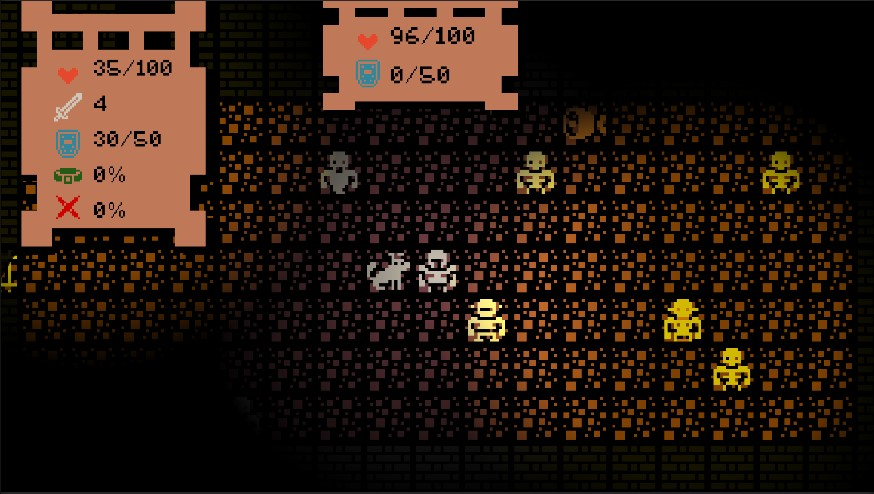

# Dungeon Crawl

## Story

- Welcome to Dungeon Crawl, an epic 2D single-player adventure RPG game developed using C# and Unity.

- Embark on a thrilling journey through a mysterious and dangerous world of dungeons, monsters, and treasure. As a brave adventurer, you seek to uncover the secrets hidden within the depths of the dungeons.

- Explore each level of the game and encounter a wide variety of challenging enemies and obstacles. From skeletons and zombies to deadly orcs and other monstrous beasts, each foe presents its unique challenge that requires different strategies and tactics to overcome. You'll need to use your wits, weapons, and skills to fight your way through the hordes of monsters and emerge victorious.

- In addition to combat, Dungeon Crawl features intricate hidden treasures and secrets scattered throughout the game. Be clever and resourceful to uncover the hidden treasures and unlock the secrets of the dungeon.

- Dungeon Crawl features intuitive controls that allow you to move around the levels, fight enemies, and interact with objects easily. The 2D graphics are stunningly detailed and atmospheric, bringing the game's world to life with vibrant colors and dynamic lighting. The immersive soundtrack perfectly complements the game's dark and foreboding atmosphere.

- As a C# and Unity-based game, Dungeon Crawl provides an excellent opportunity for aspiring game developers to learn and develop their skills. The game's architecture is designed to be modular, making it easy to modify and extend.

- Overall, Dungeon Crawl is a must-play game for any fan of the RPG genre. With its thrilling gameplay, full of secrets, and immersive world, it's sure to keep you entertained for hours on end. Join us on this adventure and discover the secrets of the dungeon!

### Used technologies:
1. [C#](https://learn.microsoft.com/en-us/dotnet/csharp/)
2. [Unity](https://docs.unity.com/)

### Project Features:
- Game can be saved and loaded in any moment in format [Json](https://www.json.org/json-en.html)
- Secret areas
- Find and equip items for bonus stats

### How to Run the Project?
1. Clone the [Repo](https://github.com/CatalinCatta/DungeonCrawl.git).
2. Run DungeonCrawl.exe
3. Have Fun!

